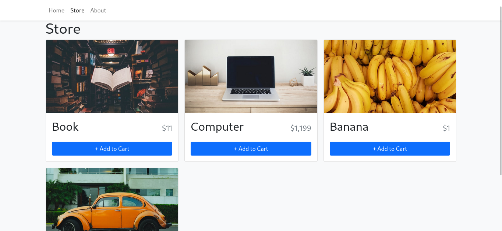

# Webdevsimplified - Shopping cart exercise

This is a tutorial/exercise to build **Shopping Cart Page** from [webdevsimplified](https://www.youtube.com/c/WebDevSimplified), built using typescript and bootstrap.

[How To Create An Advanced Shopping Cart With React and TypeScript](https://www.youtube.com/watch?v=lATafp15HWA)

## Table of contents

- [Overview](#overview)
- [My process](#my-process)
  - [Built with](#built-with)
  - [What I learned](#what-i-learned)

## Overview

### The challenge

Users should be able to:

- Input one or more items to the cart, saved in local storage.
- See responsive design on mobile view.

### Screenshot



## My process

### Built with

- Semantic HTML5 markup
- CSS custom properties
- Mobile-first workflow
- React JS
- Typescript
- Bootstrap

### What I learned

Make custom localStorage hook

```javascript
function useLocalStorage(key, initialValue) {
  const [value, setValue] = useState(() => {
    const jsonValue = localStorage.getItem(key);
    if (jsonValue !== null) return JSON.parse(jsonValue);
    if (typeof initialValue === "function") return (initialValue)();
    return initialValue;
  });

  useEffect(() => {
    localStorage.setItem(key, JSON.stringify(value));
  }, [key, value]);

  return [value, setValue];
}
```

Make currency function

```javascript
const CURRENCY_FORMATER = new Intl.NumberFormat(undefined, {
  currency: "USD",
  style: "currency",
});

function formatCurrency(number: number) {
  return CURRENCY_FORMATER.format(number);
}
```
